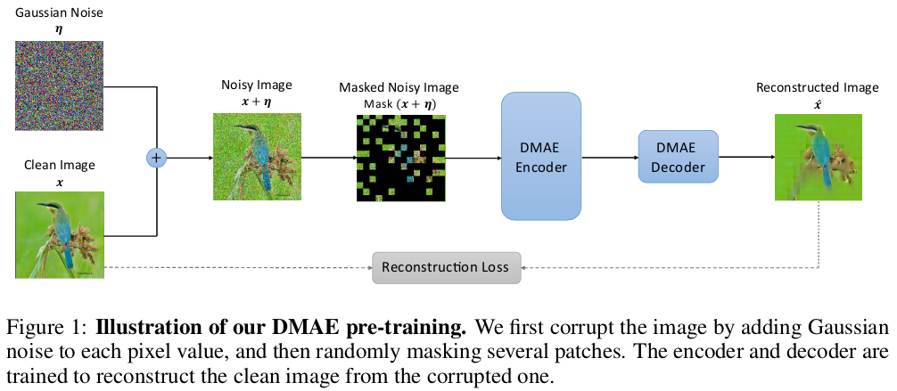
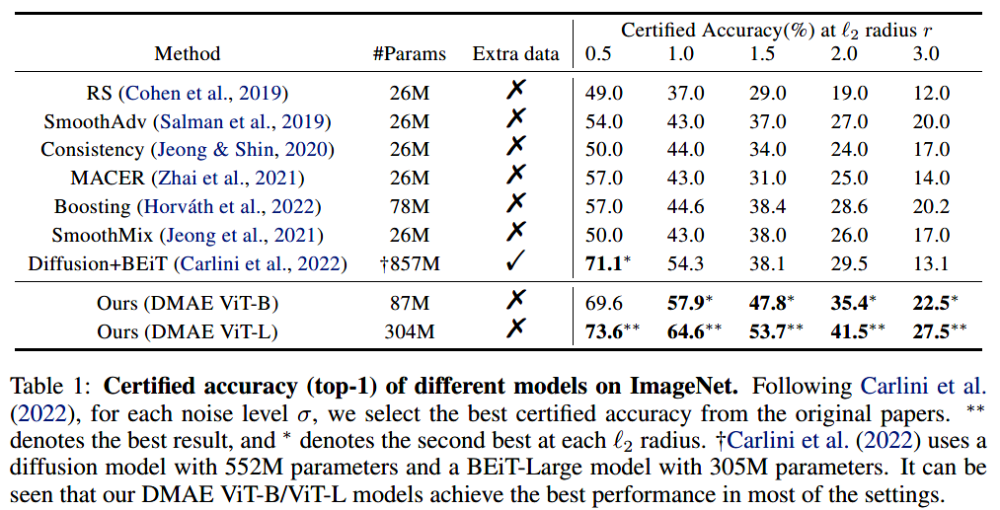
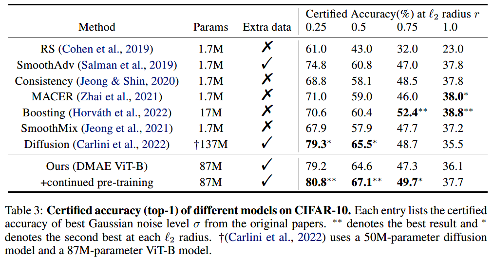

# Denoising Masked Autoencoders Help Robust Classification (ICLR 2023)
<p align="center">
  
</p>

This repository is the official implementation of [“Denoising Masked Autoencoders Help Robust Classification”](https://arxiv.org/abs/2210.06983), based on the official implementation of [MAE](https://github.com/facebookresearch/mae) in [PyTorch](https://github.com/pytorch/pytorch).
```
@inproceedings{wu2023dmae,
  title={Denoising Masked Autoencoders Help Robust Classification},
  author={Wu, QuanLin and Ye, Hang and Gu, Yuntian and Zhang, Huishuai and Wang, Liwei and He, Di},
  booktitle={The Eleventh International Conference on Learning Representations},
  year={2023}
}
```

### Pre-training
The pre-training instruction is in [PRETRAIN.md](PRETRAIN.md).

The following table provides the pre-trained checkpoints used in the paper:
<table><tbody>
<!-- START TABLE -->
<!-- TABLE HEADER -->
<th valign="bottom">Model</th>
<th valign="bottom">Size</th>
<th valign="bottom">Epochs</th>
<th valign="bottom">Link</th>
<!-- TABLE BODY -->
<tr><td align="left">DMAE-Base</td>
<td align="center">427MB</td>
<td align="center">1100</td>
<td align="center"><a href="https://1drv.ms/u/s!AnxRCBR6qpJqiiyVY-qxN_AKNwhA?e=Xb6mlj">download</a></td>
</tr>
<!-- TABLE BODY -->
<tr><td align="left">DMAE-Large</td>
<td align="center">1.23GB</td>
<td align="center">1600</td>
<td align="center"><a href="https://1drv.ms/u/s!AnxRCBR6qpJqii1fTOzAG3tBSDn6?e=PxxadF">download</a></td>
</tr>
</tbody></table>

### Fine-tuning
The fine-tuning and evaluation instruction is in [FINETUNE.md](FINETUNE.md).
#### Results on ImageNet
<p align="left">
  
</p>

#### Results on CIFAR-10
<p align="left">
  
</p>

### License
This project is under the CC-BY-NC 4.0 license. See [LICENSE](LICENSE) for details.
